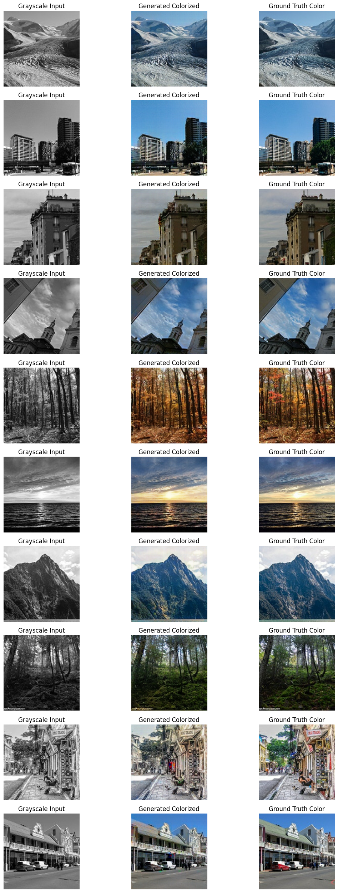
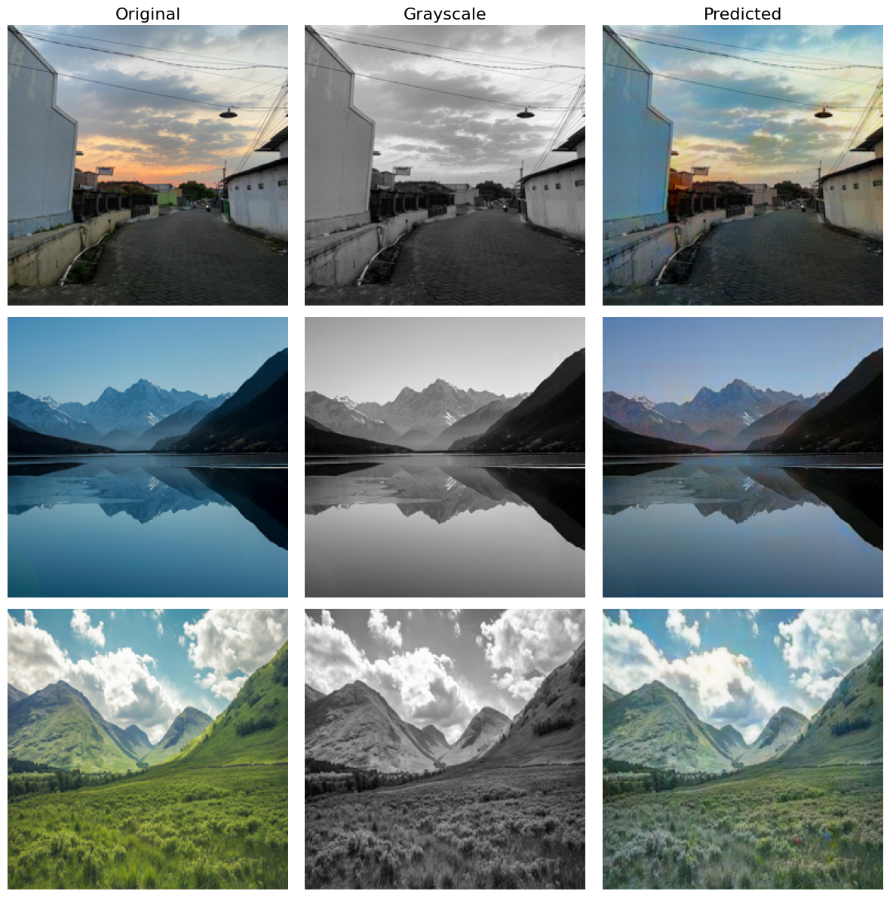

# Image Colorization using pix2pix

[](https://www.kaggle.com/code/aminrezaeeyan/ai-image-colorization-pix2pix-gan)

This project implements an image colorization solution using the pix2pix model, a Conditional Generative Adversarial Network (cGAN) designed for image-to-image translation. It transforms black-and-white images into colored versions, leveraging the Landscape-Image-Colorization dataset from Kaggle. The goal is to demonstrate the practical application of pix2pix for colorization, providing a robust and scalable framework for experimentation, analysis, and real-world application.

## Overview

The Image Colorization using pix2pix project showcases how the pix2pix model, a type of Conditional GAN (cGAN), can be used to convert grayscale images into colored outputs. By training on paired grayscale and colored images from the Landscape-Image-Colorization dataset, the model learns to map visual structures from one domain to another. Images in the dataset, originally 150x150 pixels, are upscaled to the standard pix2pix input size of 256x256 to ensure optimal performance. The training process incorporates advanced techniques like early stopping, learning rate decay, and validation, making it both efficient and adaptable for practical use.

This project is ideal for researchers, developers, and enthusiasts interested in understanding and applying GANs, particularly cGANs, to image processing tasks. It offers a clear example of how pix2pix can be implemented, evaluated, and extended, with results that balance quality and computational feasibility.

## Pre-Trained Models

You can download the pre-trained weights for the generator and discriminator directly from the `models` directory of this repository:

- `generator.weights.h5`: Contains the weights for the generator model, which is responsible for producing colored images from grayscale inputs.
- `discriminator.weights.h5`: Contains the weights for the discriminator model, which evaluates the realism of the generated colored images.

To use these pre-trained models in your own environment:

- For the generator:
  ```python
  generator = build_generator()
  generator.load_weights('path/to/generator.weights.h5')
  ```
  Ensure you have the `build_generator()` function defined in your code to create the generator architecture before loading the weights. You can apply the same process to the discriminator if needed by using `build_discriminator()` and loading `discriminator.weights.h5`.

The training code for pix2pix is fully prepared and available in a Kaggle notebook. Click the Kaggle badge at the top of this README to open the notebook directly in `Kaggle`, where you can explore, modify, or run the training pipeline.

## Results

The model demonstrates consistent performance across the train, validation, and test datasets, with the following average metrics:

- **Train Dataset**: PSNR: 30.8109, SSIM: 0.9480
- **Validation Dataset**: PSNR: 30.7696, SSIM: 0.9483
- **Test Dataset**: PSNR: 30.8765, SSIM: 0.9468

These metrics indicate that the model generalizes well, producing colored images with reasonable quality and structural fidelity. While the results are not at a professional level, they are sufficient for experimental purposes and provide a solid foundation for further improvements. Visual examples of the model’s generated outputs are available in the image below:



and some larger images:



## Background

The pix2pix model, developed by Phillip Isola and colleagues, is a pioneering cGAN framework for paired image-to-image translation tasks. It uses a U-Net generator and a PatchGAN discriminator to ensure high-quality, spatially coherent outputs. Our implementation adapts this approach to focus on colorizing images, using TensorFlow and Keras for efficient deep learning. The Landscape-Image-Colorization dataset serves as our training ground, offering a rich set of paired grayscale and colored landscape images.

## Technical Details

- **Data Pipeline**: Utilizes TensorFlow’s tf.data API for efficient loading, preprocessing (upscaling to 256x256 and normalization), and splitting into train, validation, and test sets.
- **Training Features**: Includes batch processing (batch size of 64), early stopping, learning rate decay, and model checkpointing to save the best-performing models.
- **Evaluation**: Employs PSNR and SSIM to assess numerical accuracy and perceptual quality, respectively, ensuring a comprehensive evaluation of colorization performance.

## Limitations

While effective, the current implementation has some limitations:

- The model’s performance is constrained by the quality and diversity of the Landscape-Image-Colorization dataset, which may not generalize perfectly to all types of images.
- The upscaling from 150x150 to 256x256 can introduce artifacts, potentially affecting fine details in the colorized outputs.
- PSNR and SSIM values, while respectable, indicate room for improvement in achieving higher fidelity and realism, especially for professional applications.

## Contributing

We welcome contributions from the community! If you’re interested in improving the model, dataset, or documentation, please fork this repository, make your changes, and submit a pull request. For significant changes, please open an issue first to discuss your ideas and ensure alignment with the project’s goals.

## Acknowledgments

- Inspired by the original pix2pix paper by Phillip Isola et al.
- Utilizes the Landscape-Image-Colorization dataset from Kaggle.
- Built with TensorFlow, Keras, and other open-source tools for deep learning and data processing.

## Contact

If you have questions or suggestions, please open an issue in this repository or reach out at [rezaeeyanamin@gmail.com](mailto:rezaeeyanamin@gmail.com). We’re eager to hear from you and collaborate on advancing image colorization technologies!
